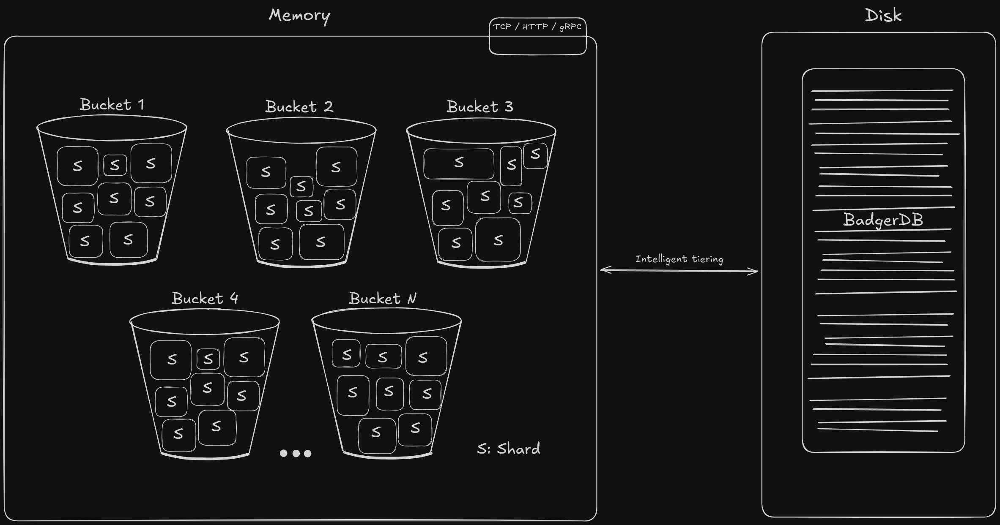

  
  <h1 align="center">Bukt</h1>
  

    A high-performance in-memory key-value store with an intelligent tiered storage engine.
  

---

Bukt is a modern key-value store written in Go, designed for speed and simplicity. It provides extremely fast read operations by serving data directly from memory, while an optional, intelligent storage engine works to optimize RAM usage by offloading cold data to a persistent disk layer. The current API is primarily designed for handling string data.

## Project Status

> **Warning**
> Bukt is currently under active development and should not be used in production environments. The API is subject to change, and the feature set is not yet complete.

## Design Philosophy

-   **Read-Optimized Performance:** Bukt is architected for read-heavy workloads. The data path for retrieving hot data from memory is highly concurrent and designed to be virtually lock-free, enabling extremely high throughput for read operations.
-   **Memory Cost-Efficiency:** While providing the speed of an in-Mmemory database, Bukt remains cost-efficient. The intelligent storage engine ensures that the memory footprint stays small by automatically offloading the least frequently used data to a persistent disk layer. This provides access to larger-than-memory datasets without sacrificing performance for your most active data.

## Benchmarks

Detailed benchmarks for various workloads (read-heavy, write-heavy, mixed) are underway and will be published soon.

## Features

- **Bucket Mechanism:** Organize your data into isolated namespaces called buckets.
- **Sharding:** Keys are automatically distributed across multiple shards to reduce lock contention and improve concurrency on multi-core systems.
- **Intelligent Storage Model (Tiered):** Frequently accessed data remains in memory for maximum speed. An efficient LRU-based algorithm automatically detects and offloads less-used items to disk, freeing up RAM without sacrificing access to your complete dataset.
- **Data Compression:** Optional on-the-fly data compression to reduce the storage footprint for large values.
- **Time-to-Live (TTL):** Set an automatic expiration time for your keys. Bukt efficiently manages and removes expired data in the background.
- **Single-Read Keys:** Create keys that are automatically deleted after being read once, ideal for temporary or single-use data patterns.
- **Pluggable Storage Engine:** The persistent storage layer is designed to be pluggable. The upcoming stable version will be powered by **BadgerDB**, a battle-tested, high-performance embedded database.
- **Multiple Transport Layers:**
  - **HTTP/REST:** A simple and convenient API for standard web-based interactions.
  - **TCP & gRPC:** (Planned) For high-performance, low-latency communication between services.
- **Container Ready:** Comes with a setup for quick, isolated deployments.

### Core Architecture

  

## Getting Started

*(Instructions for building and running the project will be added as the project matures.)*

---

  <em>Inspired by the concept of "buckets" for data organization.</em>

